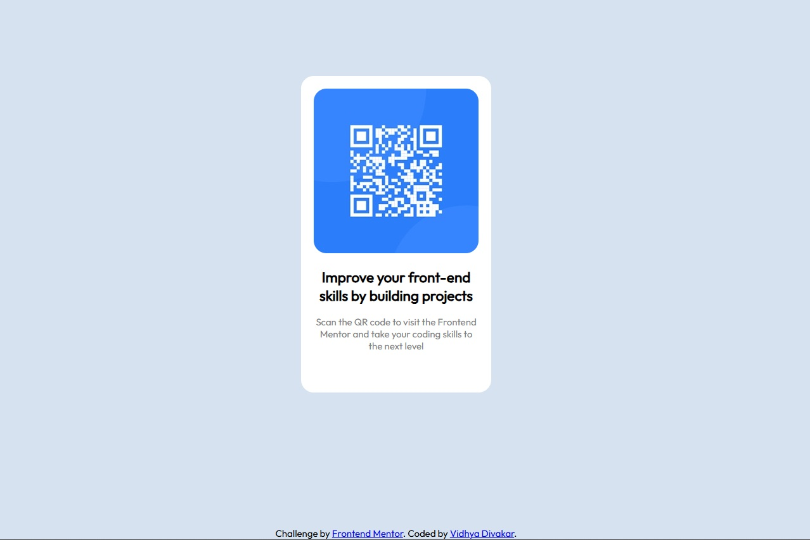

# Frontend Mentor - QR code component solution

This is a solution to the [QR code component challenge on Frontend Mentor](https://www.frontendmentor.io/challenges/qr-code-component-iux_sIO_H). Frontend Mentor challenges help you improve your coding skills by building realistic projects.

## Table of contents

- [Overview](#overview)

  - [Screenshot](#screenshot)
  - [Links](#links)
- [My process](#my-process)

  - [Built with](#built-with)
  - [What I learned](#what-i-learned)
  - [Author](#author)

**Note: Delete this note and update the table of contents based on what sections you keep.**

## Overview

I have successfully completed the **QR Code Component challenge** from Frontend Mentor.

This project focuses on building a simple card layout that displays a QR code with text instructions. The goal is to practice **HTML structure and CSS styling** while matching the design provided in the challenge.

### Screenshot

## My process

I started by analyzing the design and identifying the main sections of the card component. Then I created the **HTML structure** for the container, image, heading, and description text.

After completing the HTML, I styled the layout using CSS to match the spacing, colors, and typography from the design. I used **flexbox to center the card on the page** and adjusted padding, border radius, and shadows to make the component look close to the original design.

### Built with

- Semantic HTML5 markup
- CSS
- Flexbox
- Google Fonts

### What I learned

While working on this project, I practiced how to:

- Structure a simple webpage using semantic HTML
- Use **flexbox to center elements vertically and horizontally**
- Apply **border-radius, spacing, and shadows** to match a design layout
- Keep the code simple and organized for small UI components

This project helped reinforce my **HTML and CSS fundamentals** and gave me more confidence in building small frontend components.

### Author

Vidhya Divakar
